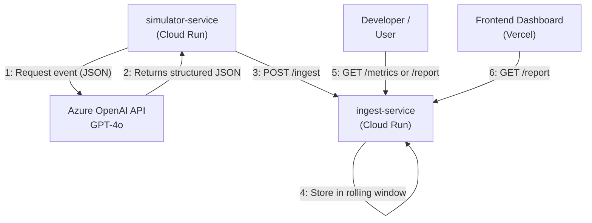

# AI Agent Monitoring Platform

This project is a simplified monitoring and observability platform for AI agents, built with two main services: an **Ingest & Metrics Service** and an **Event Simulator Service**.

## Project Overview

- **`ingest-service`**: A Node.js/TypeScript service that ingests simulated event data, maintains a rolling window of recent events, and exposes Prometheus-style metrics and a JSON report.
- **`simulator-service`**: A Node.js/TypeScript service that uses an LLM to generate plausible user interaction events and sends them to the `ingest-service`.

## Dashboard & Demo

A Next.js frontend has been created to visualize the data from the monitoring service.


- **Live Dashboard**: [https://next-js-dashboard-pied-tau.vercel.app/](https://next-js-dashboard-pied-tau.vercel.app/)
- **Video Demo**: [Watch a demo on Loom](https://www.loom.com/share/ceb7d97c76e84651beeaebaa69b74c90?sid=fbb533e3-9fd0-47e5-a201-ec5ab2a36517)

## Public URLs

*   **Ingest & Metrics Service**: `https://ingest-service-1066080214358.us-central1.run.app`
*   **Event Simulator Service**: `https://simulator-service-1066080214358.us-central1.run.app`

## Data Flow Diagram



## Data Flow Explanation

1.  The `simulator-service` runs a continuous loop. Every 60 seconds, it sends a request to the **Azure OpenAI GPT-4o** model. The request includes a specific JSON schema that defines the structure of the desired event data.
2.  We use GPT-4o specifically because of its excellent support for **structured outputs**. It reliably returns a JSON object that conforms to our schema, which minimizes the need for complex parsing or error handling on our end.
3.  The `simulator-service` then takes this valid JSON event and sends it via an HTTP POST request to the `/ingest` endpoint of the `ingest-service`.
4.  The `ingest-service` receives the event, validates it, and stores it in an in-memory rolling window (last 5 minutes or 30 events).
5.  A developer or user can then access the `/metrics` and `/report` endpoints on the `ingest-service` to get real-time analytics based on the ingested events.
6.  A Next.js frontend dashboard running on Vercel fetches data from the `/report` endpoint to provide a rich visualization of the voice events.

## How to Test the Endpoints

You can use `curl` or your web browser to interact with the deployed services.

### Simulator Service

You can visit the public URL to confirm it's running:

```bash
curl https://simulator-service-1066080214358.us-central1.run.app
```

### Ingest Service

- **`/ingest` (POST)**: While this is primarily used by the simulator, you can manually post an event:
    ```bash
    curl -X POST https://ingest-service-1066080214358.us-central1.run.app/ingest \
    -H "Content-Type: application/json" \
    -d '{
      "timestamp": "2025-06-12T10:00:00.000Z",
      "sessionId": "manual-test",
      "intent": "TestIntent",
      "latencyMs": 50,
      "success": true,
      "confidence": 0.99
    }'
    ```

- **`/metrics` (GET)**: View Prometheus-style metrics.
    ```bash
    curl https://ingest-service-1066080214358.us-central1.run.app/metrics
    ```

- **`/report` (GET)**: View a JSON summary report.
    ```bash
    curl https://ingest-service-1066080214358.us-central1.run.app/report
    ```

## Code Snippets

### `simulator-service`: Generating Structured Events with GPT-4o

This snippet from `simulator-service/src/index.ts` shows how we leverage GPT-4o's native JSON mode to get reliable, structured data.

```typescript
// ... existing code ...
const eventSchema = z.object({
    intent: z.string().describe("The user's intent, e.g., 'bookFlight', 'checkWeather', 'orderFood', 'playMusic'. CAN BE ANYTHING"),
    confidence: z.number().min(0).max(1).describe("A float between 0.0 and 1.0 representing the confidence level."),
});

// ...

const result = await openAIClient.chat.completions.create({
    model: deployment, // This is our GPT-4o deployment
    messages: [
        { role: 'system', content: `You are a helpful assistant that generates plausible events for a voice agent interaction based on a given schema. You must respond with a JSON object that follows the provided schema. Here is the schema: ${JSON.stringify(zodToJsonSchema(eventSchema), null, 2)}`},
        { role: 'user', content: "Generate a new event." }
    ],
    // This is key: we instruct the model to only output JSON
    response_format: { type: 'json_object' } 
});
// ...
```

### `ingest-service`: Ingesting and Storing Events

The following is a conceptual example of how events are handled in `ingest-service`, based on the project requirements.

```typescript
// In-memory store for events
const events = [];

// Endpoint to ingest events
app.post('/ingest', (req, res) => {
    const event = req.body;
    // Add validation logic here...

    // Add event to our in-memory store
    events.push(event);

    // Trim events to maintain a rolling window
    // (e.g., based on timestamp or count)
    // ...

    res.status(200).send({ message: 'Event ingested' });
});
```

## Cloud Architecture

Both services are deployed as containerized applications on **Google Cloud Run**.

- **Containerization**: Each service has a `Dockerfile` that packages it into a portable container image.
- **Artifact Registry**: The Docker images are stored in Google Artifact Registry.
- **Cloud Build**: Google Cloud Build is used to automatically build the Docker images from the source code and push them to Artifact Registry.
- **Cloud Run**: This serverless platform was chosen to run the containers. It automatically scales based on traffic, simplifies deployment, and provides each service with a public HTTPS URL. The `simulator-service` was initially deployed as a Cloud Run Job but was changed to a Service to meet the requirement of having a public URL.
- **Environment Variables**: Securely passed to the Cloud Run services to configure them (e.g., API keys, target URLs).

This architecture was chosen because it's fast to deploy, requires no server management, and is cost-effective for this type of workload. 