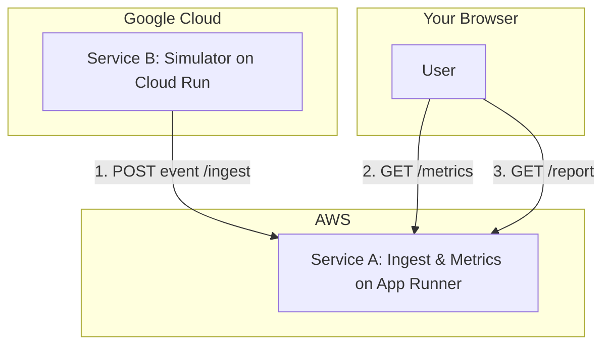

# AI Agent Monitoring Platform

This project contains two services:
1.  `ingest-service` (Service A): Ingests events and provides metrics.
2.  `simulator-service` (Service B): Generates and sends events.

## Cloud Architecture

- **Service A (`ingest-service`)** is deployed on **AWS App Runner**.
- **Service B (`simulator-service`)** is deployed on **Google Cloud Run**.

The `simulator-service` generates a plausible voice agent event and `POST`s it to the public `/ingest` endpoint of the `ingest-service`. The `ingest-service` then makes metrics available at its `/metrics` and `/report` endpoints.



---

## Local Development & Testing

You can run both services locally using Docker Compose.

1.  **Prerequisites:** Docker must be installed and running.
2.  **Environment:** Create a `.env` file in the root directory with your Azure OpenAI credentials:
    ```
    AZURE_OPENAI_ENDPOINT=your_endpoint_here
    AZURE_OPENAI_KEY=your_key_here
    AZURE_OPENAI_DEPLOYMENT=your_deployment_name_here
    ```
3.  **Run:**
    ```bash
    docker-compose up --build
    ```
4.  **Verify:** After about a minute, the simulator will send its first event. You can then check the ingest service's endpoints:
    - **Metrics:** `http://localhost:8080/metrics`
    - **Report:** `http://localhost:8080/report`


## Deployment

### Service A: `ingest-service` to AWS App Runner

Follow these steps to deploy the ingest service.

**Prerequisites:**
- An AWS account.
- AWS CLI installed and configured.
- Docker installed.

**1. Create an ECR Repository**

First, we need a private repository in the Amazon Elastic Container Registry (ECR) to store our Docker image.

```bash
aws ecr create-repository --repository-name ingest-service --region YOUR_AWS_REGION
```
*(Replace `YOUR_AWS_REGION` with your preferred region, e.g., `us-east-1`)*

**2. Build, Tag, and Push the Docker Image**

Navigate to the `ingest-service` directory.
```bash
cd ingest-service
```

Now, build the Docker image, and then tag and push it to the ECR repository you created. Replace `AWS_ACCOUNT_ID` and `YOUR_AWS_REGION` in the commands below.

```bash
# Authenticate Docker with ECR
aws ecr get-login-password --region YOUR_AWS_REGION | docker login --username AWS --password-stdin AWS_ACCOUNT_ID.dkr.ecr.YOUR_AWS_REGION.amazonaws.com

# Build the image
docker build -t ingest-service .

# Tag the image for ECR
docker tag ingest-service:latest AWS_ACCOUNT_ID.dkr.ecr.YOUR_AWS_REGION.amazonaws.com/ingest-service:latest

# Push the image to ECR
docker push AWS_ACCOUNT_ID.dkr.ecr.YOUR_AWS_REGION.amazonaws.com/ingest-service:latest
```

**3. Deploy on AWS App Runner**

1.  Go to the [AWS App Runner console](https://console.aws.amazon.com/apprunner/).
2.  Click **Create an App Runner service**.
3.  For **Source**, select **Container registry** and **Amazon ECR**.
4.  For **Container image URI**, browse and select your `ingest-service` repository from ECR.
5.  Choose **Automatic** deployment release. App Runner will redeploy your service automatically whenever you push a new image to ECR.
6.  Click **Next**.
7.  Give your service a name (e.g., `ingest-service`).
8.  For **Virtual CPU & memory**, the defaults are fine.
9.  For **Port**, set it to `8080`.
10. Click **Next**.
11. Review the configuration and click **Create & deploy**.

Deployment will take a few minutes. Once it's complete, App Runner will provide a **Default domain** URL. This is the public URL for your service.

**Save this URL!** You will need it for deploying Service B.

---

### Service B: `simulator-service` to Google Cloud Run

**Prerequisites:**
- A Google Cloud Platform (GCP) project.
- Google Cloud SDK (`gcloud`) installed and configured.
- Your Azure OpenAI credentials (`AZURE_OPENAI_ENDPOINT`, `AZURE_OPENAI_KEY`, `AZURE_OPENAI_DEPLOYMENT`).
- The public URL for Service A from the previous step.

**1. Enable APIs**

You'll need to enable the Artifact Registry and Cloud Run APIs for your GCP project.

```bash
gcloud services enable artifactregistry.googleapis.com
gcloud services enable run.googleapis.com
```

**2. Create an Artifact Registry Repository**

This is where you'll store the Docker image for the simulator.

```bash
gcloud artifacts repositories create simulator-repo \
    --repository-format=docker \
    --location=YOUR_GCP_REGION \
    --description="Simulator service repository"
```
*(Replace `YOUR_GCP_REGION` with your preferred region, e.g., `us-central1`)*

**3. Build, Tag, and Push the Docker Image**

Navigate to the `simulator-service` directory and authenticate Docker with the Google Artifact Registry.
```bash
cd simulator-service

# Configure Docker to use gcloud for authentication
gcloud auth configure-docker YOUR_GCP_REGION-docker.pkg.dev
```

Now, build, tag, and push the image. Replace `YOUR_GCP_PROJECT_ID` and `YOUR_GCP_REGION`.

```bash
# Build the image
docker build -t simulator-service .

# Tag the image
docker tag simulator-service:latest YOUR_GCP_REGION-docker.pkg.dev/YOUR_GCP_PROJECT_ID/simulator-repo/simulator-service:latest

# Push the image
docker push YOUR_GCP_REGION-docker.pkg.dev/YOUR_GCP_PROJECT_ID/simulator-repo/simulator-service:latest
```

**4. Deploy to Cloud Run**

Deploy the service using `gcloud`. This command is broken into multiple lines for readability.

Replace the placeholder values:
- `YOUR_GCP_REGION`
- `YOUR_GCP_PROJECT_ID`
- `YOUR_SERVICE_A_URL` (The URL from AWS App Runner)
- The values for your Azure OpenAI credentials.

```bash
gcloud run deploy simulator-service \
    --image YOUR_GCP_REGION-docker.pkg.dev/YOUR_GCP_PROJECT_ID/simulator-repo/simulator-service:latest \
    --platform managed \
    --region YOUR_GCP_REGION \
    --allow-unauthenticated \
    --set-env-vars="TARGET_URL=https://YOUR_SERVICE_A_URL/ingest" \
    --set-env-vars="AZURE_OPENAI_ENDPOINT=YOUR_AZURE_ENDPOINT" \
    --set-env-vars="AZURE_OPENAI_KEY=YOUR_AZURE_KEY" \
    --set-env-vars="AZURE_OPENAI_DEPLOYMENT=YOUR_AZURE_DEPLOYMENT"
```

After deployment, Cloud Run will provide a URL for the simulator. You don't need to access it directly; you can check its logs in the GCP console to see it running and posting events.

---

## Verifying End-to-End Functionality

Once both services are deployed:
1.  Check the logs for `simulator-service` in the Google Cloud Run console to confirm it's generating events and posting them.
2.  After a minute, visit the public URLs for your `ingest-service` on AWS App Runner:
    - `https://YOUR_SERVICE_A_URL/metrics`
    - `https://YOUR_SERVICE_A_URL/report`

You should see the metrics and report data from the events sent by the simulator. 